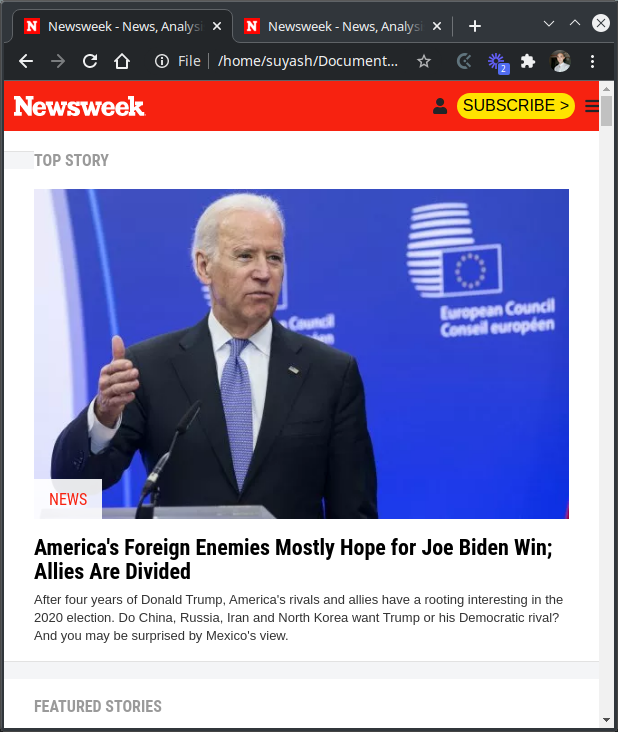
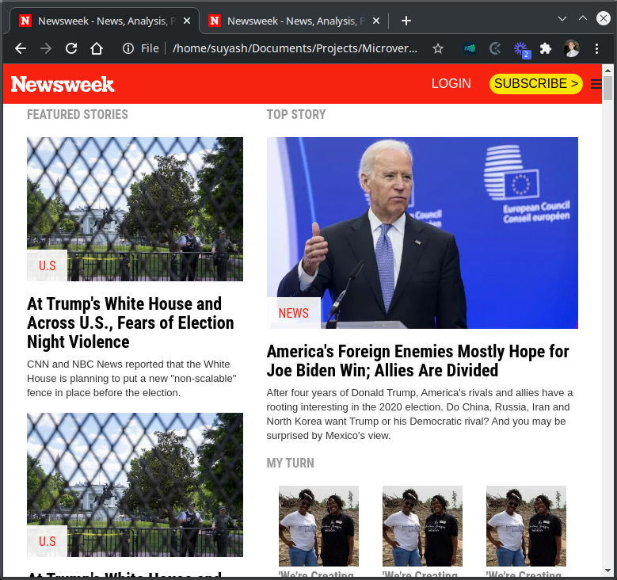
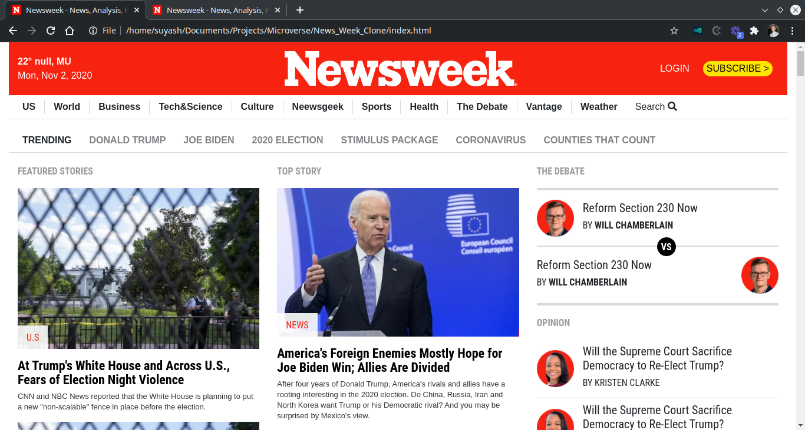

# News_Week_Clone

> Third Project at Microverse to get better at using CSS frameworks like Bootstrap.

## Screenshot

### Mobile:

### Tablet:

### Desktop:

## Description

This project is a replica of [News Week page](https://www.newsweek.com/).

It is a static version. All contents (texts, images, icons and fonts) have been retrieved from the News Week website itself.

## Built With

- HTML 
- CSS
- Bootstrap
- Linter
- VScode

## Demo Link
[Live Demo Link](https://krishnzzz.github.io/News_Week_Clone/)

## Contributing
Contributions, issues and feature requests are welcome! Start by:

  - Forking the project
  - Cloning the project to your local machine
  - cd into the project directory
  - Run git checkout -b your-branch-name
  - Make your contributions
  - Push your branch up to your forked repository
  - Open a Pull Request with a detailed description to the development branch of the original project for a review

## Authors

👤 Suyash Fowdar
Github: [@Krishnzzz](https://github.com/krishnzzz)

👤 Pascal Byabasaija
Github: [@Byabasaija](https://github.com/Byabasaija)

## Show your Support
Give a ⭐ if you like this project!